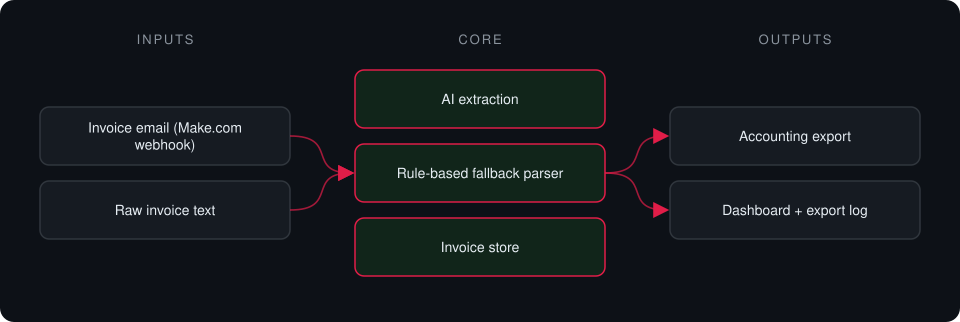

# Make Invoice Automation

**Receives invoice emails through a Make.com webhook, extracts structured data and exports it to accounting.**

> **This is a proprietary project. Source code is private. This page showcases the system's architecture and results.**

**Case study page:** [https://jryahia.github.io/showcase-make-invoice-automation/](https://jryahia.github.io/showcase-make-invoice-automation/)

## Problem it solves

Retyping supplier invoices into a spreadsheet or accounting tool is error-prone busywork. This service parses incoming invoices into structured records and pushes them onward automatically.

## Architecture

1. Make.com forwards an invoice email to the webhook.
2. Invoice fields are extracted with AI, with a rule-based fallback.
3. The structured invoice is stored.
4. It is exported to the accounting destination, and the export is logged.

## Key features

- Webhook receiver for Make.com
- AI extraction with a deterministic fallback
- Vendor, totals and dates captured
- Export log
- Built-in test parser

## Tech stack

     

## What it does in practice

- Removes manual data entry for incoming invoices.

## Screenshots

**Parsed invoice and totals**

---

Built by [Yahya Jarray](https://github.com/jryahia). Interested in a similar system? [Get in touch](mailto:yahiajarray43@gmail.com).
